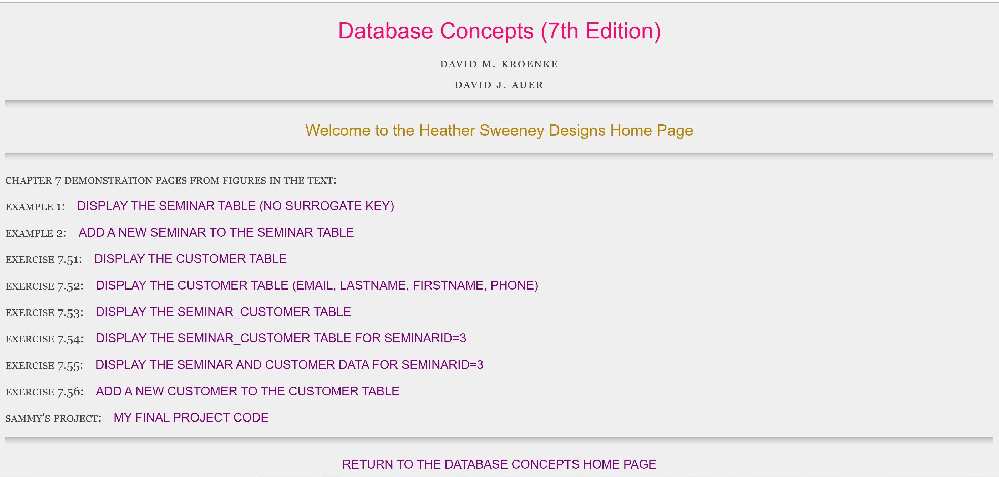
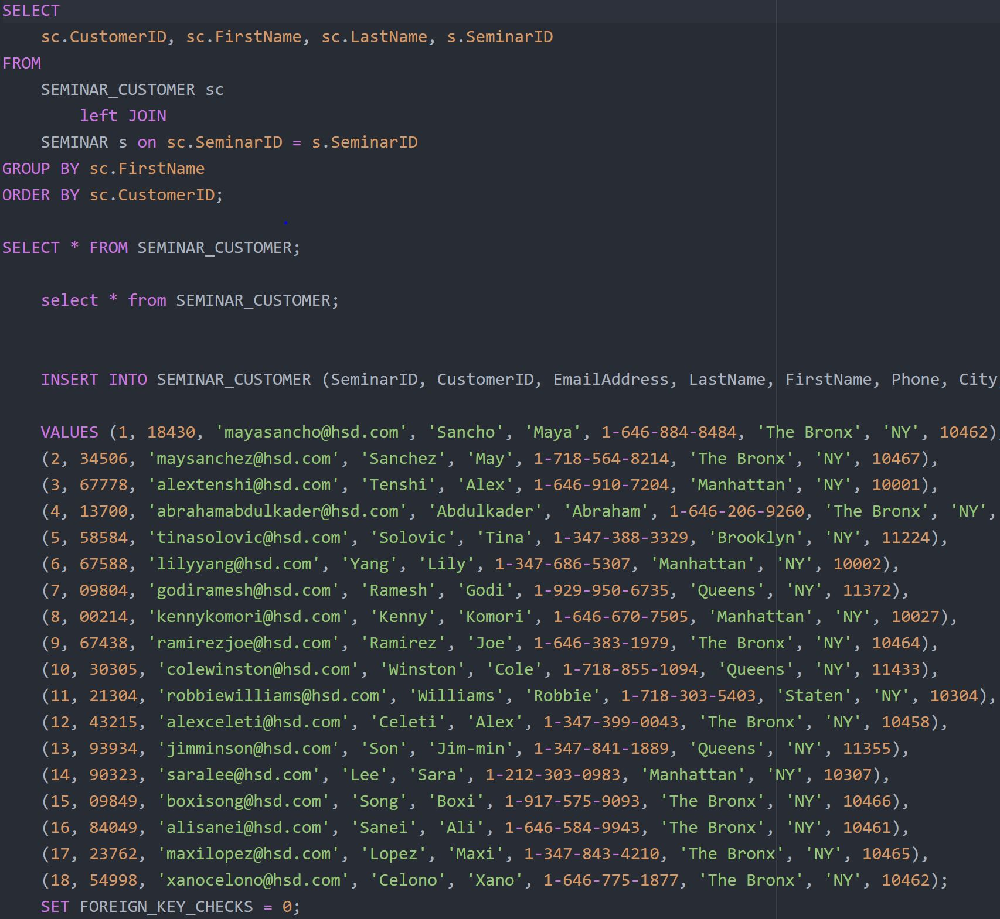
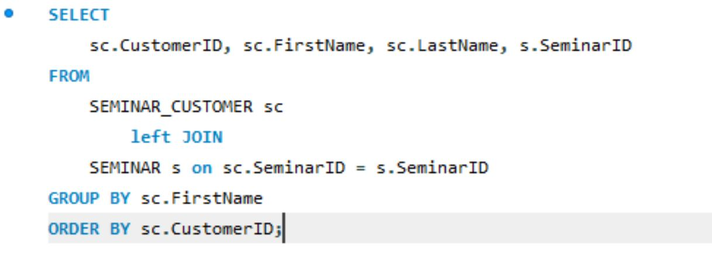

# Redesign-HSD-MySQL-PHP-Activity
Updating CSS in the HTML files and added few PHP and MYSQL

# This is my side project I done after taking an MySQL DataBase course...

- This just shows that database can be use for PHP and MySQL code to pages
- An example is The Heather Sweeney Design is example page of customer and employees recorded for business purposes.
- However, it servers as best practice to understand basic code from both MySQL & PHP

# My webpage:

http://sabdul.it.pointpark.edu:3000/

### HSD page

### MySQL code

### join statements

## This section is on the project side bar of my website!
